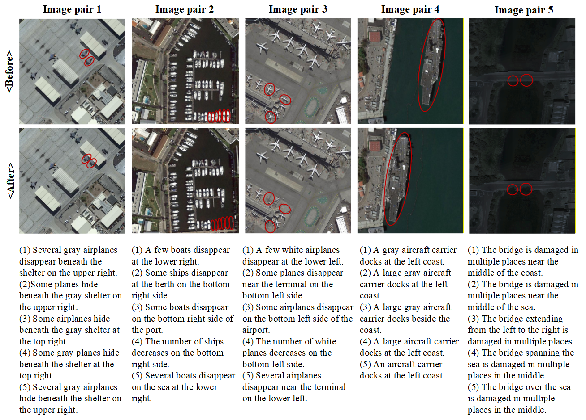
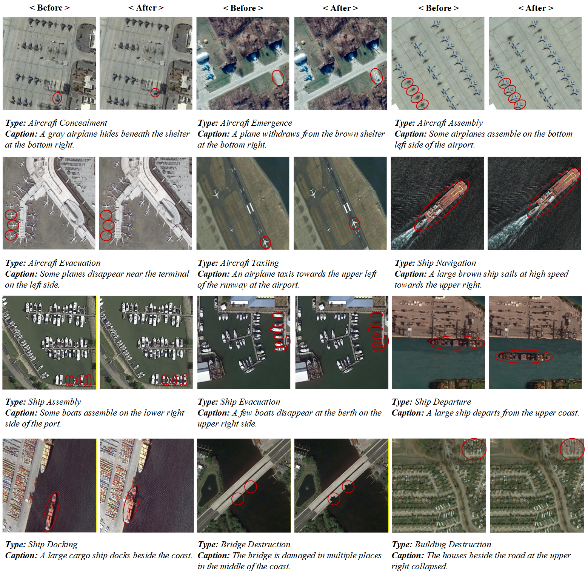

# ARS-CC Dataset

ARS-CC Dataset is a light-aware aerial remote sensing image dataset, featuring paired images and corresponding change captions. It is specifically designed to capture short-term behavioral changes of dynamic military targets under diverse and complex illumination conditions.

As illustrated below, each image pair includes five captions, with red circles marking the change regions. The dataset is characterized by cross-scale targets and robust performance across varying lighting environments.

## Results

We report the captioning results of our DF-MSRformer model on 12 types of target changes below.

